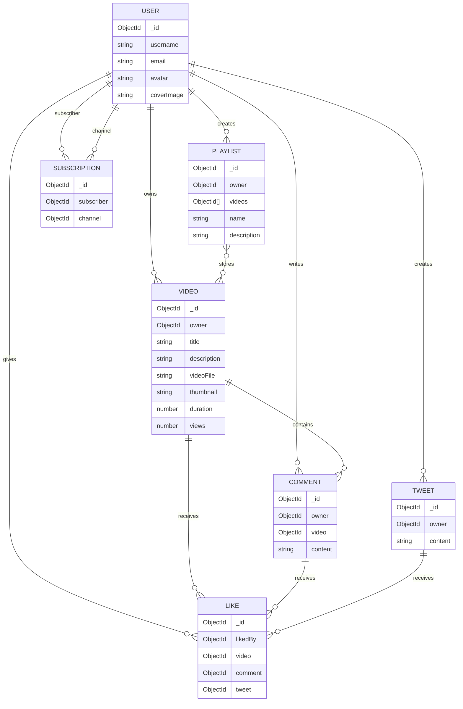
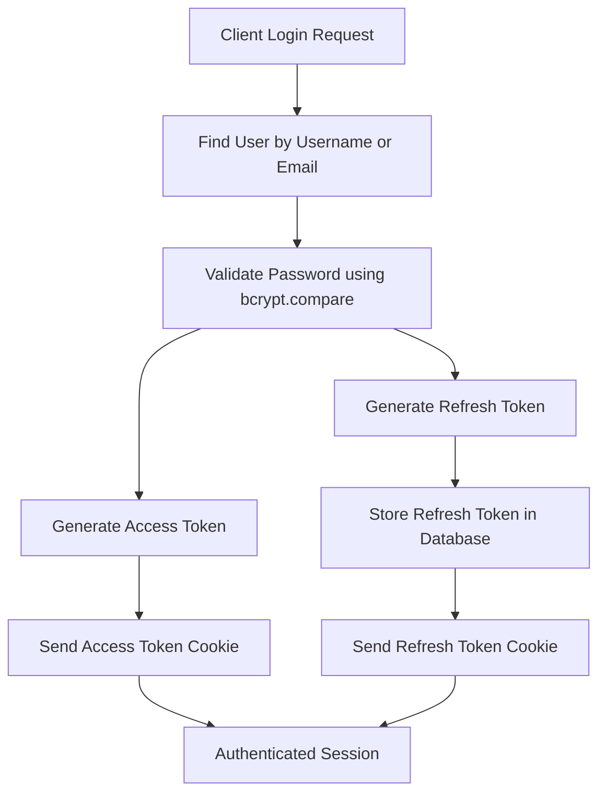
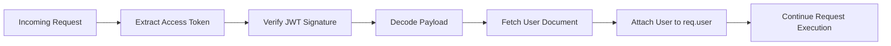
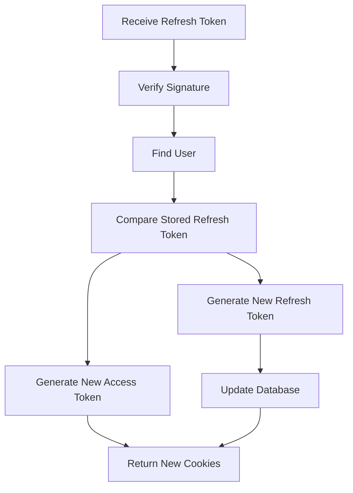
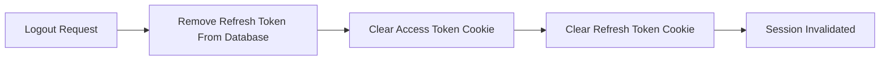

# 🚀 OmniFeed (YT & Tweets Engine)
> **A Production-Grade, Enterprise-Ready Social Media & Content Distribution Backend Pipeline.**

OmniFeed is a robust, high-throughput RESTful API designed to power modern content distribution platforms. It unifies complex media streaming logic (similar to YouTube) with micro-blogging connectivity systems (similar to X/Twitter). Built purely as an architectural showcase, this project highlights highly optimized database queries, industrial-grade data validation wrappers, parallel aggregation data streaming, and secure token lifecycle management.

---

## 🔥 Highlighted System Features

*   ⚡ **Parallel Aggregation Engine:** Leverages advanced MongoDB `$facet`, `$unwind`, and `$group` operations to execute multi-collection analytics concurrently, drastically optimizing server memory allocations.
*   🛡️ **Cryptographic Identity Control:** Implements atomic access and dynamic refresh token rotation architectures using dual-layered JWT verification protocols alongside asymmetric hashing (`bcrypt`).
*   🏗️ **Enterprise Architecture Modularity:** Engineered with a strict **Separation of Concerns (SoC)** architecture. The codebase is broken down into clean, independent modules—isolating Express routing parameters, controller execution blocks, database models, and validation middleware to allow the system to scale without code friction.
*   📦 **Defensive Cloud File Pipeline:** Integrates a secure, multi-stage file management system utilizing `multer` for raw local disk buffering and `cloudinary` storage clusters for assets.
*   ⚙️ **Production-Grade Design Safeguards:** Built with strict production patterns including centralized async error interceptors (`asyncHandler`) to eliminate repetitive try-catch blocks, and specialized request object defenses (`req.params || {}`) to guard against structural server crashes.
*   🎛️ **Centralized Error & Response Framework:** Implements strict data contracts across the application using unified wrapper modules (`ApiError`, `ApiResponse`) that prevent internal application data leaks and standardize downstream client consumption.

---

## 🛠️ The Core Technical Matrix

| Technology / Library | Architectural Responsibility | Engineering Purpose |
| :--- | :--- | :--- |
| **Runtime & Framework** | `Node.js` & `Express 5.2.1` | Asynchronous I/O routing layer managing client streams. |
| **Primary Database** | `MongoDB` & `Mongoose 9.7.1` | Document cluster schema layer with custom validation hooks. |
| **Query Pagination** | `mongoose-aggregate-paginate-v2` | Cursor-based chunking for heavy multi-document query loads. |
| **Asset CDN Pipeline** | `Multer` & `Cloudinary` | Automated upload processing, stream processing, and multi-region file hosting. |
| **Security Architecture** | `jsonwebtoken` & `bcrypt` | Digital signature verification alongside cryptographic hashing protocols. |
| **Cross-Origin Pipeline** | `cors` & `cookie-parser` | Restricting resource access models and managing HTTP-only cookies. |

---

# 🏗️ System Architecture, Design & Data Flow

The backend follows a **Decoupled Three-Tier Architecture** consisting of:

* **Routing Layer**
* **Controller & Service Orchestration Layer**
* **Data Persistence Layer**

The architecture is designed with the following goals:

* Horizontal scalability
* Secure authentication and authorization
* Efficient media processing
* Centralized error handling
* Minimal database overhead
* Cloud-native storage support

---

# 🔄 Request Lifecycle

Every request passes through multiple layers before interacting with persistent storage.

```text
Client Request
      │
      ▼
┌─────────────────────────────┐
│ Application Middleware Layer│
│ - CORS                      │
│ - Cookie Parser             │
│ - JSON Parser               │
│ - Security Headers          │
└──────────────┬──────────────┘
               │
               ▼
┌─────────────────────────────┐
│ Routing Layer               │
│ - Route Resolution          │
│ - Middleware Binding        │
└──────────────┬──────────────┘
               │
               ▼
┌─────────────────────────────┐
│ Authentication Layer        │
│ - JWT Validation            │
│ - User Authorization        │
└──────────────┬──────────────┘
               │
               ▼
┌─────────────────────────────┐
│ File Processing Layer       │
│ - Multer Upload Pipeline    │
│ - Temporary Storage         │
└──────────────┬──────────────┘
               │
               ▼
┌─────────────────────────────┐
│ Controller Layer            │
│ - Business Logic            │
│ - Service Invocation        │
└──────────────┬──────────────┘
               │
               ▼
┌─────────────────────────────┐
│ Database Layer              │
│ - MongoDB Operations        │
│ - Aggregation Pipelines     │
└──────────────┬──────────────┘
               │
               ▼
         API Response
```

---

# 🗄️ Database Design

The application uses a **normalized MongoDB schema design** to avoid document bloat, improve query performance, and support future scalability.

## Entity Relationship Diagram



---

# 📚 Schema Relationships

## 👤 User

The primary entity of the system responsible for authentication, authorization, ownership, and user interactions.

### Features

* Indexed username lookup
* Password hashing using bcrypt
* JWT authentication
* Refresh token management

---

## 🎥 Video

Stores media metadata and cloud-hosted asset references.

### Relationships

* Owned by a single user.
* Can contain multiple comments.
* Can receive multiple likes.
* Can belong to multiple playlists.

---

## 💬 Comment

Represents user discussions on videos.

### Relationships

* Written by a user.
* Associated with exactly one video.
* Can receive likes.

---

## 📝 Tweet

Supports lightweight micro-blogging functionality.

### Relationships

* Created by a user.
* Can receive likes.

---

## ❤️ Like

Implements polymorphic interactions.

A like can belong to one of:

* Video
* Comment
* Tweet

This design prevents duplication of interaction logic across collections.

---

## 📂 Playlist

Represents a user-defined collection of videos.

### Relationships

* Owned by a user.
* Contains multiple videos.
* Supports dynamic collection sizes without duplicating video documents.

---

## 🔔 Subscription

Implements the follower-following relationship.

### Relationships

* `subscriber → User`
* `channel → User`

This creates a scalable many-to-many self-referencing graph.

---

# 🛡️ Architectural Decisions

## Centralized Async Error Handling

```javascript
const asyncHandler = (requestHandler) => {
  return (req, res, next) => {
    Promise.resolve(
      requestHandler(req, res, next)
    ).catch(next);
  };
};
```

### Benefits

* Eliminates repetitive try-catch blocks.
* Provides centralized error handling.
* Keeps controllers clean and maintainable.

---

## Standardized API Responses

### Success Response

```json
{
  "success": true,
  "message": "Operation completed successfully",
  "data": {}
}
```

### Error Response

```json
{
  "success": false,
  "message": "Unauthorized access"
}
```

---

## Automated Media Cleanup Pipeline

```javascript
try {
  const response = await cloudinary.uploader.upload(
    localFilePath,
    {
      resource_type: "auto"
    }
  );

  unlinkSync(localFilePath);

  return response;
} catch (error) {
  unlinkSync(localFilePath);

  return null;
}
```

This guarantees that temporary files are deleted regardless of upload success or failure.


---
## ⚡ Performance Optimizations

- MongoDB Aggregation Pipelines
- Database Indexing
- Selective Field Projection
- Pagination Support
- Cloud CDN Media Delivery
- Stateless Authentication
- Request Payload Limits
- Async Error Handling
```

# 🔀 API Modules

| Module                  | Access Level | Description                           |
| ----------------------- | ------------ | ------------------------------------- |
| `/api/v1/healthcheck`   | Public       | Server health monitoring              |
| `/api/v1/users`         | Mixed        | Authentication and profile management |
| `/api/v1/videos`        | Protected    | Video management                      |
| `/api/v1/tweets`        | Protected    | Tweet CRUD operations                 |
| `/api/v1/comments`      | Protected    | Comment operations                    |
| `/api/v1/playlists`     | Protected    | Playlist management                   |
| `/api/v1/likes`         | Protected    | Interaction endpoints                 |
| `/api/v1/subscriptions` | Protected    | Subscription management               |
| `/api/v1/dashboard`     | Protected    | Analytics and creator statistics      |

---
```
## 📌 Complete API Endpoints Reference

All request pathways are strictly prefixed under the explicit routing layer `GET/POST/PATCH/DELETE /api/v1`. 

---

### 👤 Authentication & User Subsystem (`/api/v1/users`)

| Method | Endpoint | Access Shield | Middleware / Payload Processing | Functional Responsibility |
| :--- | :--- | :--- | :--- | :--- |
| **POST** | `/register` | 🔓 Public | `upload.fields(['avatar', 'coverImage'])` | Creates a new user account and handles cloud-hosted asset uploads. |
| **POST** | `/login` | 🔓 Public | *None* | Authenticates user credentials, sets secure tokens, and initializes a session. |
| **POST** | `/logout` | 🔐 Protected | `verifyJWT` | Destroys active refresh hashes in the DB and wipes client side cookies. |
| **POST** | `/refresh-token` | 🔓 Public | *None* | Validates long-term refresh cookies to instantly rotate and update short-term tokens. |
| **PATCH** | `/change-password` | 🔐 Protected | `verifyJWT` | Validates current password hashes to update to a new user password. |
| **GET** | `/current-user` | 🔐 Protected | `verifyJWT` | Fetches active account information from `req.user` without exposing passwords. |
| **PATCH** | `/update-account` | 🔐 Protected | `verifyJWT` | Updates partial non-file profile metadata fields (email, names, etc.). |
| **PATCH** | `/update-avatar` | 🔐 Protected | `verifyJWT` + `upload.single('avatar')` | Overwrites old avatar files in cloud storage with a new file asset. |
| **PATCH** | `/update-coverImage` | 🔐 Protected | `verifyJWT` + `upload.single('coverImage')` | Overwrites old background banner artwork assets with a new file upload. |
| **GET** | `/channel/:username` | 🔐 Protected | `verifyJWT` | Aggregates dynamic metrics (subscribers, counts) for a target profile. |
| **PATCH** | `/watch/:videoId` | 🔐 Protected | `verifyJWT` | Injects a targeted video pointer directly into the user's view history array. |
| **GET** | `/watch/history` | 🔐 Protected | `verifyJWT` | Runs an aggregation loop to return the authenticated user's watch history. |

---

### 🎥 Video Subsystem (`/api/v1/videos`)

| Method | Endpoint | Access Shield | Middleware / Payload Processing | Functional Responsibility |
| :--- | :--- | :--- | :--- | :--- |
| **GET** | `/` | 🔐 Protected | `verifyJWT` | Returns a paginated list feed of global videos based on filter options. |
| **POST** | `/` | 🔐 Protected | `verifyJWT` + `upload.fields(['videoFile', 'thumbnail'])` | Bundles raw media streams and thumbnails to publish content live. |
| **GET** | `/:videoId` | 🔐 Protected | `verifyJWT` | Fetches complete metadata records and tracking fields for a single video. |
| **PATCH** | `/:videoId` | 🔐 Protected | `verifyJWT` + `upload.single('thumbnail')` | Modifies text meta fields or overwrites video preview thumbnails. |
| **DELETE** | `/:videoId` | 🔐 Protected | `verifyJWT` | Wipes video assets from database layers and triggers a sync cloud purge. |
| **PATCH** | `/toggle/publish/:videoId` | 🔐 Protected | `verifyJWT` | Alternates visibility states between true/false to switch private/public. |

---

### 📝 Tweet Subsystem (`/api/v1/tweets`)

| Method | Endpoint | Access Shield | Middleware / Payload Processing | Functional Responsibility |
| :--- | :--- | :--- | :--- | :--- |
| **POST** | `/` | 🔐 Protected | `verifyJWT` | Commits a new micro-blogging short text record to the database. |
| **GET** | `/user/:userId` | 🔐 Protected | `verifyJWT` | Queries and collects all short updates authored by a target account. |
| **PATCH** | `/:tweetId` | 🔐 Protected | `verifyJWT` | Allows authors to edit the string content of an existing micro-post. |
| **DELETE** | `/:tweetId` | 🔐 Protected | `verifyJWT` | Permanently deletes a specific tweet post out of user document feeds. |

---

### 💬 Comment Subsystem (`/api/v1/comments`)

| Method | Endpoint | Access Shield | Middleware / Payload Processing | Functional Responsibility |
| :--- | :--- | :--- | :--- | :--- |
| **GET** | `/:videoId` | 🔐 Protected | `verifyJWT` | Uses aggregate pagination to load discussion feeds mapped to a video. |
| **POST** | `/:videoId` | 🔐 Protected | `verifyJWT` | Appends a fresh discussion text comment string under a target media file. |
| **PATCH** | `/c/:commentId` | 🔐 Protected | `verifyJWT` | Allows an account owner to rewrite their original comment text. |
| **DELETE** | `/c/:commentId` | 🔐 Protected | `verifyJWT` | Removes an explicitly targeted comment entry out of active threads. |

---

### 📂 Playlist Subsystem (`/api/v1/playlists`)

| Method | Endpoint | Access Shield | Middleware / Payload Processing | Functional Responsibility |
| :--- | :--- | :--- | :--- | :--- |
| **POST** | `/` | 🔐 Protected | `verifyJWT` | Sets up a blank custom collection container mapped to the user creator. |
| **GET** | `/:playlistId` | 🔐 Protected | `verifyJWT` | Resolves array pointers to return complete lists of populated videos. |
| **PATCH** | `/:playlistId` | 🔐 Protected | `verifyJWT` | Modifies name structures or description lines of the target compilation. |
| **DELETE** | `/:playlistId` | 🔐 Protected | `verifyJWT` | Drops the playlist tracking entity completely without removing raw videos. |
| **PATCH** | `/add/:videoId/:playlistId` | 🔐 Protected | `verifyJWT` | Appends an existing video object pointer inside the playlist's collection array. |
| **PATCH** | `/remove/:videoId/:playlistId` | 🔐 Protected | `verifyJWT` | Pulls out a target video object pointer out of the playlist's storage set. |
| **GET** | `/user/:userId` | 🔐 Protected | `verifyJWT` | Collects every custom folder collection created by a target account ID. |

---

### ❤️ Likes & Reactions Subsystem (`/api/v1/likes`)

| Method | Endpoint | Access Shield | Middleware / Payload Processing | Functional Responsibility |
| :--- | :--- | :--- | :--- | :--- |
| **POST** | `/toggle/v/:videoId` | 🔐 Protected | `verifyJWT` | Toggles standard user engagement status on a video file. |
| **POST** | `/toggle/c/:commentId` | 🔐 Protected | `verifyJWT` | Toggles standard user engagement status on a thread comment. |
| **POST** | `/toggle/t/:tweetId` | 🔐 Protected | `verifyJWT` | Toggles standard user engagement status on a micro-blog post. |
| **GET** | `/videos` | 🔐 Protected | `verifyJWT` | Runs an aggregation query to collect every video document liked by the user. |

---

### 🔔 Subscription Subsystem (`/api/v1/subscriptions`)

| Method | Endpoint | Access Shield | Middleware / Payload Processing | Functional Responsibility |
| :--- | :--- | :--- | :--- | :--- |
| **POST** | `/c/:channelId` | 🔐 Protected | `verifyJWT` | Toggles subscription mappings to follow or unfollow a profile. |
| **GET** | `/c/:channelId` | 🔐 Protected | `verifyJWT` | Resolves target junction records to list all user documents following the channel. |
| **GET** | `/u/subscribedChannels` | 🔐 Protected | `verifyJWT` | Aggregates user paths to return all creator channel hubs followed by the user. |

---

### 📊 Creator Dashboard & Diagnostics (`/api/v1/dashboard` & `/api/v1/healthcheck`)

| Method | Endpoint | Access Shield | Middleware / Payload Processing | Functional Responsibility |
| :--- | :--- | :--- | :--- | :--- |
| **GET** | `/dashboard/stats` | 🔐 Protected | `verifyJWT` | Runs a `$facet` look up to return total channel views, likes, and subscribers. |
| **GET** | `/dashboard/videos` | 🔐 Protected | `verifyJWT` | Collects all uploaded media records belonging to the logged-in creator. |
| **GET** | `/healthcheck` | 🔓 Public | *None* | Diagnostic route returning JSON signals confirming backend engine health. |

# 🚀 Key Features

* JWT Authentication
* Refresh Token Rotation
* Role-Based Access Control
* Cloudinary Media Storage
* MongoDB Aggregation Pipelines
* Centralized Error Handling
* RESTful API Design
* Modular Project Structure
* API Versioning
* Secure File Upload Pipeline

---

## 📁 Project Directory Structure

The application enforces a highly structured **Separation of Concerns (SoC)** by separating business logic, models, controllers, and routing schemes inside a clean `src/` directory tree layout:

```text
OmniFeed-ytTweets/
├── public/
│   └── temp/                 # Local temporary disk buffer for incoming file streams
├── src/
│   ├── controllers/          # Business logic handlers processing requests/responses
│   ├── db/                   # Database connection scripts and configurations
│   ├── middlewares/          # Custom auth shields, file upload configs, and interceptors
│   ├── models/               # Persistent Mongoose schema relationship definitions
│   ├── routes/               # API endpoint dispatch maps categorized by resource
│   ├── utils/                # Standardized global helpers (Async, Errors, CDNs)
│   ├── app.js                # Perimeter gateway configurator (CORS, Parsers, Cookies)
│   ├── config.js             # Environment variables orchestration management
│   ├── constants.js          # Shared system-wide constant configuration tokens
│   └── index.js              # Primary server bootstrap entry point executing runtime setup
├── .env                      # Local runtime environment cryptographic signature keys
├── .gitignore                # Target array tracking directories omitted from Git tracking
├── .prettierignore           # Code formatter exclusion boundaries
├── .prettierrc               # Code syntax style standard specifications
├── package-lock.json         # Complete pinned tree list of downstream dependencies
├── package.json              # Core manifest containing project scripts and engine keys
└── readme.md                 # Complete primary documentation portal
```

## ⚙️ Environment Variables Setup

Create a file named `.env` in the root directory of your project and populate it with the following configuration details:

```env
PORT=8000
CORS_ORIGIN=*

# MongoDB Connection String
MONGODB_URI=mongodb+srv://
# Cryptographic JSON Web Token Configuration
ACCESS_TOKEN_SECRET=
ACCESS_TOKEN_EXPIRY=1d
REFRESH_TOKEN_SECRET=
REFRESH_TOKEN_EXPIRY=10d

# Cloudinary CDN Configuration Assets
CLOUDINARY_CLOUD_NAME=
CLOUDINARY_API_KEY=
CLOUDINARY_API_SECRET=

```

## 🔐 Authentication & Token Lifecycle

The authentication system follows a **dual-token JWT architecture** that separates short-lived authorization credentials from long-lived session credentials.

This approach provides:

* Stateless authentication
* Secure session persistence
* Refresh token rotation
* Protection against token replay attacks
* Reduced server-side memory usage

---

## 🔄 Dual Token Strategy

The application uses two independent JWTs with different responsibilities.

| Token             | Lifetime  | Storage Location                   | Purpose                                                              |
| ----------------- | --------- | ---------------------------------- | -------------------------------------------------------------------- |
| **Access Token**  | `1 day`   | HTTP Header or Secure Cookie       | Authorizes API requests and contains non-sensitive user claims.      |
| **Refresh Token** | `10 days` | HTTP-Only Secure Cookie + Database | Generates new access tokens without requiring users to log in again. |

---```

## 📝 Registration Flow

When a new user registers via:

```text
POST /api/v1/users/register
```

the password is automatically hashed before being stored.

### Registration Pipeline

1. User submits registration details.
2. Mongoose executes the `pre("save")` middleware.
3. If the password field has changed, bcrypt generates a secure hash.
4. Only the hashed password is stored in MongoDB.

```javascript
userSchema.pre("save", async function (next) {
    if (!this.isModified("password")) return next();

    this.password = await bcrypt.hash(this.password, 10);
    next();
});
```

---

## 🔑 Login Flow

When a user authenticates via:

```text
POST /api/v1/users/login
```

the following sequence occurs:



---

### Cookie Security Configuration

Tokens are issued using secure cookie settings:

```javascript
const options = {
    httpOnly: true,
    secure: true,
    sameSite: "strict"
};
```

| Option            | Purpose                                          |
| ----------------- | ------------------------------------------------ |
| `httpOnly`        | Prevents JavaScript from accessing cookies.      |
| `secure`          | Ensures cookies are only transmitted over HTTPS. |
| `sameSite=strict` | Reduces CSRF attack vectors.                     |

---

## 🛡️ Protected Route Verification

Every protected endpoint passes through the `verifyJWT` middleware.

### Verification Pipeline



The middleware performs the following checks:

* Extracts the token from cookies or `Authorization` headers.
* Verifies the JWT signature using `ACCESS_TOKEN_SECRET`.
* Fetches the authenticated user document.
* Removes sensitive fields before attaching the user object to `req.user`.

```javascript
const user = await User.findById(decodedToken?._id)
    .select("-password -refreshToken");

req.user = user;
```

---

## 🔄 Refresh Token Rotation

To avoid forcing users to log in repeatedly, the application supports silent token refresh.

```text
POST /api/v1/users/refresh-token
```

### Refresh Flow



### Validation Steps

1. Extract refresh token from cookies.
2. Verify token signature using `REFRESH_TOKEN_SECRET`.
3. Retrieve user document from MongoDB.
4. Compare the incoming token with the token stored in the database.
5. Generate and issue a new token pair if validation succeeds.

This mechanism protects against:

* Stolen refresh tokens
* Replay attacks
* Session fixation attacks

---

## 🚪 Logout Flow

When a user logs out via:

```text
POST /api/v1/users/logout
```

the application invalidates the active session.

```javascript
await User.findByIdAndUpdate(
    req.user._id,
    {
        $unset: {
            refreshToken: 1
        }
    }
);
```

The server then clears both authentication cookies:

```javascript
res.clearCookie("accessToken");
res.clearCookie("refreshToken");
```



Once the refresh token is removed, no new access tokens can be generated, effectively terminating the session across future requests.

---

## ✅ Security Measures

The authentication system includes:

* JWT Access Tokens
* Refresh Token Rotation
* HTTP-Only Cookies
* Secure Cookie Transmission
* Password Hashing with bcrypt
* Replay Attack Protection
* Session Invalidation
* Protected Route Middleware
* Sensitive Field Projection Removal

# 🚀 Key Features

* JWT Authentication
* Refresh Token Rotation
* Role-Based Access Control
* Cloudinary Media Storage
* MongoDB Aggregation Pipelines
* Centralized Error Handling
* RESTful API Design
* Modular Project Structure
* API Versioning
* Secure File Upload Pipeline

## 🔮 Future Enhancements

- Redis Caching
- WebSocket Notifications
- Video Transcoding Pipeline
- Recommendation Engine
- Elasticsearch Integration
- Distributed Queue Workers
- Rate Limiting
- API Documentation using Swagger


# 🏁 Conclusion

The backend architecture prioritizes **scalability**, **security**, **maintainability**, and **performance** through normalized schema design, layered architecture, and centralized infrastructure management.

This design enables efficient handling of:

* Large media workloads
* High concurrency traffic
* Social interactions
* Analytical workloads
* Future feature expansion

while maintaining clean boundaries between application layers and predictable operational behavior.
