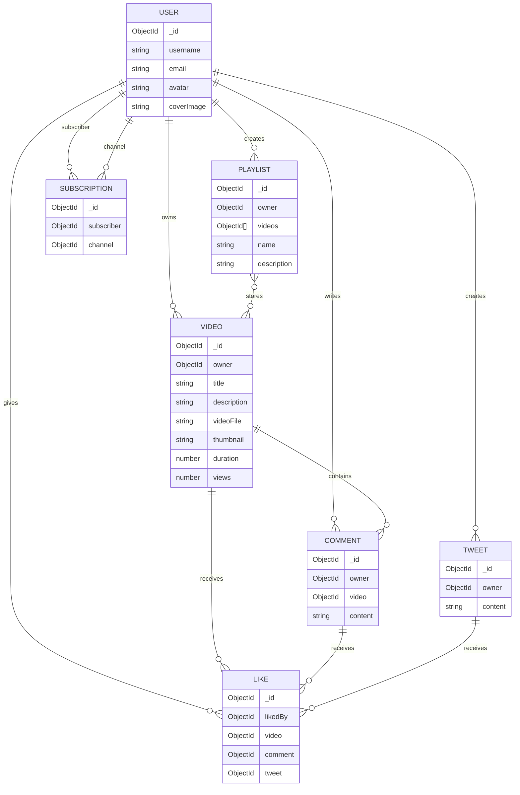

# 🚀 OmniFeed (YT & Tweets Engine)
> **A Production-Grade, Enterprise-Ready Social Media & Content Distribution Backend Pipeline.**

OmniFeed is a robust, high-throughput RESTful API designed to power modern content distribution platforms. It unifies complex media streaming logic (similar to YouTube) with micro-blogging connectivity systems (similar to X/Twitter). Built purely as an architectural showcase, this project highlights highly optimized database queries, industrial-grade data validation wrappers, parallel aggregation data streaming, and secure token lifecycle management.

---

## 🔥 Highlighted System Features

*   ⚡ **Parallel Aggregation Engine:** Leverages advanced MongoDB `$facet`, `$unwind`, and `$group` operations to execute multi-collection analytics concurrently, drastically optimizing server memory allocations.
*   🛡️ **Cryptographic Identity Control:** Implements atomic access and dynamic refresh token rotation architectures using dual-layered JWT verification protocols alongside asymmetric hashing (`bcrypt`).
*   🏗️ **Enterprise Architecture Modularity:** Engineered with a strict **Separation of Concerns (SoC)** architecture. The codebase is broken down into clean, independent modules—isolating Express routing parameters, controller execution blocks, database models, and validation middleware to allow the system to scale without code friction.
*   📦 **Defensive Cloud File Pipeline:** Integrates a secure, multi-stage file management system utilizing `multer` for raw local disk buffering and `cloudinary` storage clusters for assets.
*   ⚙️ **Production-Grade Design Safeguards:** Built with strict production patterns including centralized async error interceptors (`asyncHandler`) to eliminate repetitive try-catch blocks, and specialized request object defenses (`req.params || {}`) to guard against structural server crashes.
*   🎛️ **Centralized Error & Response Framework:** Implements strict data contracts across the application using unified wrapper modules (`ApiError`, `ApiResponse`) that prevent internal application data leaks and standardize downstream client consumption.

---

## 🛠️ The Core Technical Matrix

| Technology / Library | Architectural Responsibility | Engineering Purpose |
| :--- | :--- | :--- |
| **Runtime & Framework** | `Node.js` & `Express 5.2.1` | Asynchronous I/O routing layer managing client streams. |
| **Primary Database** | `MongoDB` & `Mongoose 9.7.1` | Document cluster schema layer with custom validation hooks. |
| **Query Pagination** | `mongoose-aggregate-paginate-v2` | Cursor-based chunking for heavy multi-document query loads. |
| **Asset CDN Pipeline** | `Multer` & `Cloudinary` | Automated upload processing, stream processing, and multi-region file hosting. |
| **Security Architecture** | `jsonwebtoken` & `bcrypt` | Digital signature verification alongside cryptographic hashing protocols. |
| **Cross-Origin Pipeline** | `cors` & `cookie-parser` | Restricting resource access models and managing HTTP-only cookies. |

---

# 🏗️ System Architecture, Design & Data Flow

The backend follows a **Decoupled Three-Tier Architecture** consisting of:

* **Routing Layer**
* **Controller & Service Orchestration Layer**
* **Data Persistence Layer**

The architecture is designed with the following goals:

* Horizontal scalability
* Secure authentication and authorization
* Efficient media processing
* Centralized error handling
* Minimal database overhead
* Cloud-native storage support

---

# 🔄 Request Lifecycle

Every request passes through multiple layers before interacting with persistent storage.

```text
Client Request
      │
      ▼
┌─────────────────────────────┐
│ Application Middleware Layer│
│ - CORS                      │
│ - Cookie Parser             │
│ - JSON Parser               │
│ - Security Headers          │
└──────────────┬──────────────┘
               │
               ▼
┌─────────────────────────────┐
│ Routing Layer               │
│ - Route Resolution          │
│ - Middleware Binding        │
└──────────────┬──────────────┘
               │
               ▼
┌─────────────────────────────┐
│ Authentication Layer        │
│ - JWT Validation            │
│ - User Authorization        │
└──────────────┬──────────────┘
               │
               ▼
┌─────────────────────────────┐
│ File Processing Layer       │
│ - Multer Upload Pipeline    │
│ - Temporary Storage         │
└──────────────┬──────────────┘
               │
               ▼
┌─────────────────────────────┐
│ Controller Layer            │
│ - Business Logic            │
│ - Service Invocation        │
└──────────────┬──────────────┘
               │
               ▼
┌─────────────────────────────┐
│ Database Layer              │
│ - MongoDB Operations        │
│ - Aggregation Pipelines     │
└──────────────┬──────────────┘
               │
               ▼
         API Response
```

---

# 🗄️ Database Design

The application uses a **normalized MongoDB schema design** to avoid document bloat, improve query performance, and support future scalability.

## Entity Relationship Diagram



---

# 📚 Schema Relationships

## 👤 User

The primary entity of the system responsible for authentication, authorization, ownership, and user interactions.

### Features

* Indexed username lookup
* Password hashing using bcrypt
* JWT authentication
* Refresh token management

---

## 🎥 Video

Stores media metadata and cloud-hosted asset references.

### Relationships

* Owned by a single user.
* Can contain multiple comments.
* Can receive multiple likes.
* Can belong to multiple playlists.

---

## 💬 Comment

Represents user discussions on videos.

### Relationships

* Written by a user.
* Associated with exactly one video.
* Can receive likes.

---

## 📝 Tweet

Supports lightweight micro-blogging functionality.

### Relationships

* Created by a user.
* Can receive likes.

---

## ❤️ Like

Implements polymorphic interactions.

A like can belong to one of:

* Video
* Comment
* Tweet

This design prevents duplication of interaction logic across collections.

---

## 📂 Playlist

Represents a user-defined collection of videos.

### Relationships

* Owned by a user.
* Contains multiple videos.
* Supports dynamic collection sizes without duplicating video documents.

---

## 🔔 Subscription

Implements the follower-following relationship.

### Relationships

* `subscriber → User`
* `channel → User`

This creates a scalable many-to-many self-referencing graph.

---

# 🛡️ Architectural Decisions

## Centralized Async Error Handling

```javascript
const asyncHandler = (requestHandler) => {
  return (req, res, next) => {
    Promise.resolve(
      requestHandler(req, res, next)
    ).catch(next);
  };
};
```

### Benefits

* Eliminates repetitive try-catch blocks.
* Provides centralized error handling.
* Keeps controllers clean and maintainable.

---

## Standardized API Responses

### Success Response

```json
{
  "success": true,
  "message": "Operation completed successfully",
  "data": {}
}
```

### Error Response

```json
{
  "success": false,
  "message": "Unauthorized access"
}
```

---

## Automated Media Cleanup Pipeline

```javascript
try {
  const response = await cloudinary.uploader.upload(
    localFilePath,
    {
      resource_type: "auto"
    }
  );

  unlinkSync(localFilePath);

  return response;
} catch (error) {
  unlinkSync(localFilePath);

  return null;
}
```

This guarantees that temporary files are deleted regardless of upload success or failure.

---

# 🔀 API Modules

| Module                  | Access Level | Description                           |
| ----------------------- | ------------ | ------------------------------------- |
| `/api/v1/healthcheck`   | Public       | Server health monitoring              |
| `/api/v1/users`         | Mixed        | Authentication and profile management |
| `/api/v1/videos`        | Protected    | Video management                      |
| `/api/v1/tweets`        | Protected    | Tweet CRUD operations                 |
| `/api/v1/comments`      | Protected    | Comment operations                    |
| `/api/v1/playlists`     | Protected    | Playlist management                   |
| `/api/v1/likes`         | Protected    | Interaction endpoints                 |
| `/api/v1/subscriptions` | Protected    | Subscription management               |
| `/api/v1/dashboard`     | Protected    | Analytics and creator statistics      |

---

# 🚀 Key Features

* JWT Authentication
* Refresh Token Rotation
* Role-Based Access Control
* Cloudinary Media Storage
* MongoDB Aggregation Pipelines
* Centralized Error Handling
* RESTful API Design
* Modular Project Structure
* API Versioning
* Secure File Upload Pipeline

---

# 🏁 Conclusion

The backend architecture prioritizes **scalability**, **security**, **maintainability**, and **performance** through normalized schema design, layered architecture, and centralized infrastructure management.

This design enables efficient handling of:

* Large media workloads
* High concurrency traffic
* Social interactions
* Analytical workloads
* Future feature expansion

while maintaining clean boundaries between application layers and predictable operational behavior.
